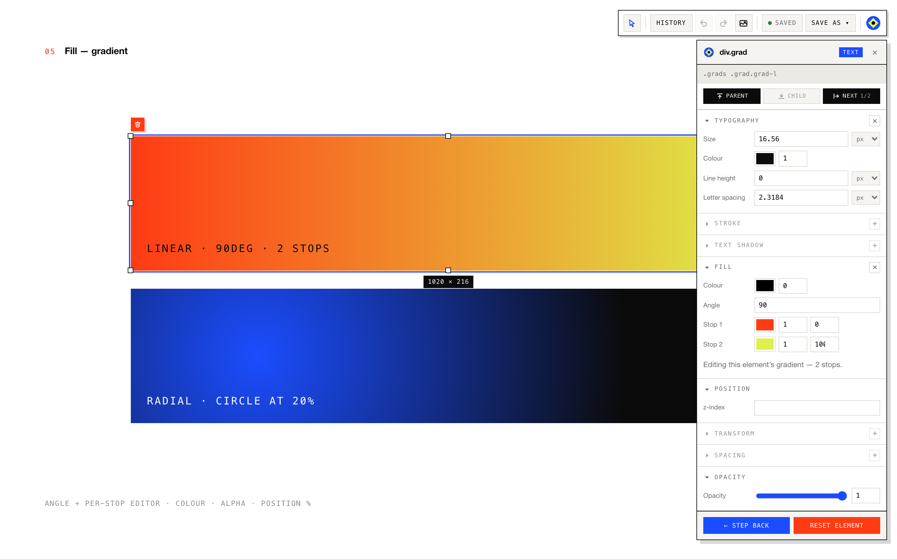
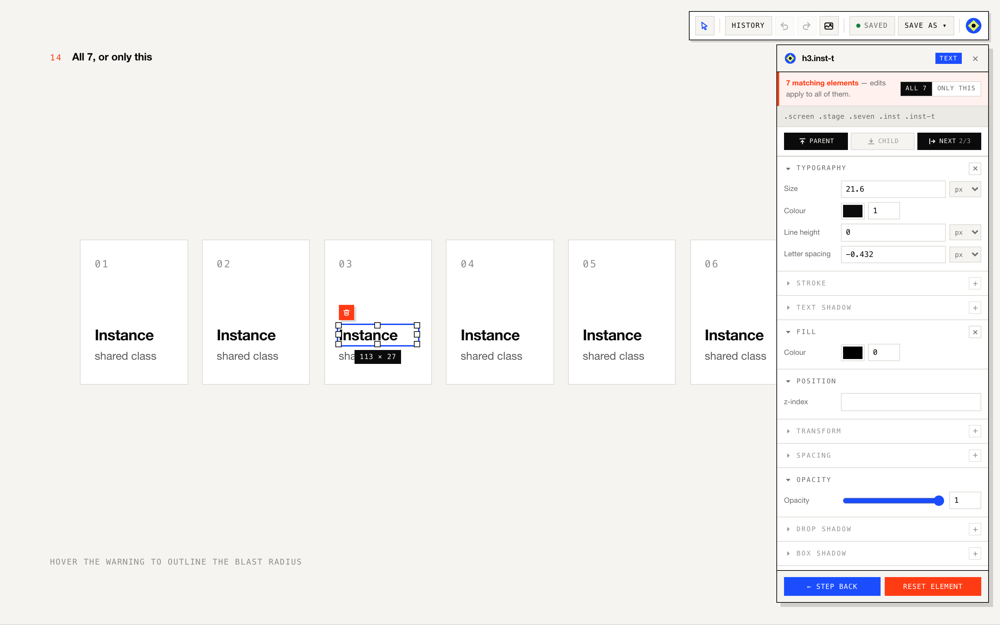
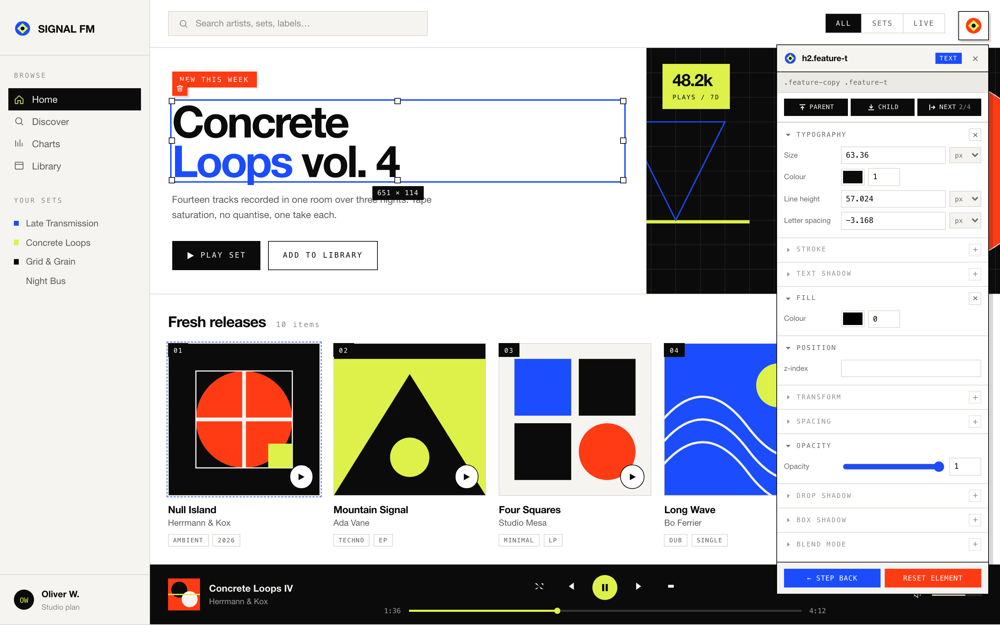

# Visual Editor

**A Figma-like inspector that runs inside any static HTML page — select, drag, restyle and re-word elements live, then save the result as ordinary CSS.**

No build step, no framework, no backend. Two files and a loader snippet turn any static site into something you can edit like a design tool — and the values are written back **in the unit they were authored in**, so a responsive `cqw` / `%` system stays intact instead of collapsing into pixels.

**[▶ Try the live playground](https://2268f1f862c941eb8066ed3e11d905ca.app-tencent.workbuddy.link/?edit=1)** — the link opens with the editor already armed. Scroll: every screen demos one capability.



## Why

Designers and developers keep round-tripping between a page and its stylesheet for tweaks that are obviously visual: nudge this title, soften that shadow, swap this cover image, try the accent in red. This editor removes the round-trip — you edit the page *on the page*, and `⌘S` writes real CSS back to the real file.

Because it reads and writes each property in its **authored unit** (`cqw`, `%`, `em`, `px`), editing a fluid layout doesn't freeze it. What you saved is what the author wrote, changed.

## What it can do

- **Select & drill in** — click selects, double-click drills into nested structures, `Tab` cycles siblings, a three-way hop row (`Parent / Child / Next`) walks the tree from the panel
- **Direct manipulation** — drag to move, eight handles to resize; an `Alt`-click cycles through stacked layers when elements fully overlap
- **Fill** — solid colours with alpha, plus a real gradient editor (angle + per-stop colour/alpha/position, linear and radial)
- **Typography, spacing, opacity, shadows** — structured editors for text shadows and box shadows, not raw CSS textareas
- **Replace image** — works for both `` and CSS `background-image`
- **SVG paint** — edits `fill` and `stroke` on vector shapes directly
- **Ungroup** — dissolve a flex/grid cluster into individually movable pieces
- **Scope control** — when an element shares a selector with others, the editor warns you and lets you pick *only this one* or *all N of them*, with a hover peek at the blast radius
- **Delete + undo** — full history panel, `⌘Z` / `⌘⇧Z`, per-element step-back and reset
- **Save to disk** — `⌘S` writes into the site's CSS file via the File System Access API; the directory handle is remembered across sessions



## The chrome

The editor's own UI was designed to disappear into the page's design language rather than shout over it:

- A master toolbar that **collapses into its own logo** — click the mark to shut it like a drawer, drag the mark to move the bar. Collapsed is a different colour (red) so the state reads at a glance
- The inspector is a floating panel with its own logo, the selected element's name, and its type; it drags anywhere and **snaps back onto the toolbar's right edge** when you bring it near
- Collapsing the toolbar never touches your selection — the two are independent on purpose
- All icons are hand-drawn SVG, ink-centred in their viewBox so nothing sits a half-pixel off



## Install

The editor is distributed as a **skill** for AI coding agents (WorkBuddy / Claude Code style): the agent installs it into your site for you. It can also be wired by hand in a minute.

### As a skill (recommended)

Copy `SKILL.md`, `PATCHES.md` and `visual-editor-assets/` into your agent's skills directory, then just ask:

> "Install the visual editor into my site."

The agent copies the two asset files into your project, injects the loader, starts a server and hands you a ready-to-click `?edit=1` link.

### By hand

```html
<!-- before </body> -->
<script>
  if (location.search.indexOf("edit=1") !== -1) {
    var css = document.createElement("link");
    css.rel = "stylesheet";
    css.href = "tools/visual-editor.css?v=18";
    document.head.appendChild(css);
    var js = document.createElement("script");
    js.src = "tools/visual-editor.js?v=18";
    js.defer = true;
    document.body.appendChild(js);
  }
</script>
```

Put `visual-editor.js` / `visual-editor.css` in `tools/` (any path works — adjust the URLs). Pages load normally without `?edit=1`: nothing is fetched, the shipped page is byte-for-byte unaffected.

Your edits save into a CSS overrides file (default `css/grid-overrides.css`) that should be the **last** stylesheet your pages link, so overrides win the cascade.

## Keyboard

| Key | Action |
|---|---|
| `⌘E` | Toggle edit ↔ browse mode |
| `⌘.` | Collapse / expand the toolbar drawer |
| `⌘S` | Save changes to disk |
| `⌘Z` / `⌘⇧Z` | Undo / redo |
| `Alt`-click | Cycle stacked layers under the cursor |
| `Tab` | Cycle siblings |
| `Esc` | Deselect |
| `Delete` | Delete the selected element (undoable) |

## The playground

The live demo is itself part of the story: a one-screen-per-capability storyboard (scroll-snapping full screens, numbered `01–16`) plus a full music-console UI to prove the editor holds up on a real, dense product surface.


## Design principles it was built under

- **No AI-flavoured styling** — no soft purple gradients, no glass blur; hairline grid, hard accent colours, square corners, single hard shadows
- **Authored units are sacred** — the panel shows `4.6 cqw`, not a resolved pixel value
- **Peers stay peers** — sibling controls are equal-width and ever-present; unavailable ones grey out in place instead of vanishing and reflowing the row
- **State is visible** — saved vs dirty, open vs shut, hovered vs not; nothing important is hidden behind a convention you have to know

See [PATCHES.md](PATCHES.md) for the engineering log — every iteration records the actual bug, the measurement that caught it, and the reasoning behind the fix.

## License

[MIT](LICENSE) — take it, ship it, tell people where you got it.
